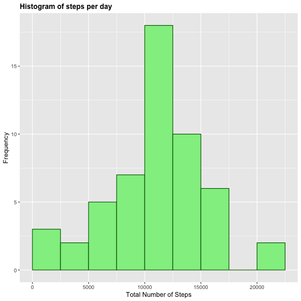
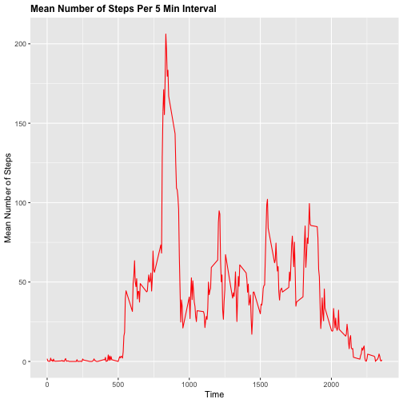
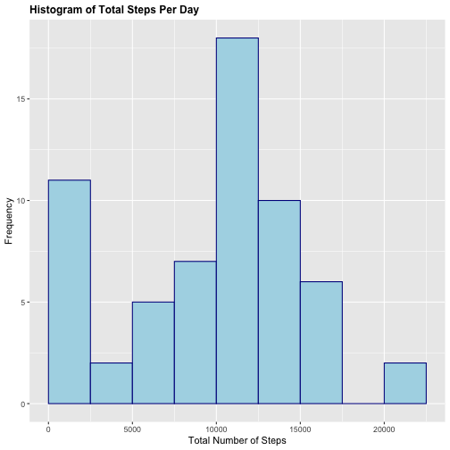
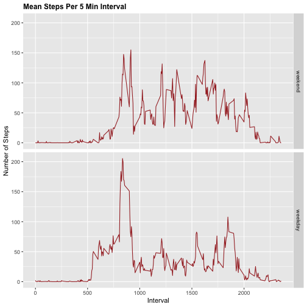

# Reproducible Reseach Course Project 1

<br>


## Loading and Preprocessing the Data

The data is loaded using the **read.csv** function. To answer the following questions, we must address this issue of missing data values, and aggregating the data appropriately. We achieve this by making use of the built in **aggregate()** function, and a custom data imputing function **impute_data()**, whose code is be shown below.  


```r
impute_data <- function(df, agg_df)  {
    for (row in 1:nrow(df))  {
        # check if there is NA value in row
        if (is.na(df[row,1]))  {
            # if NA present, replace with the value from agg_df
            # agg_df is aggregated over interval values by either mean or median, 
            # and we use the which() function to find the appropriate value in the 
            # agg_df data frame to fill in df data frame.
            df[row,1] <- agg_df[which(agg_df$interval==df[row,3]),2]
        }
    }
    return(df)
}
```


The following data frames are constructed from the initial dataframe in the activity.csv
file. The dates in activity.csv are characters, and the **as.Date()** function is used to 
make plotting more convenient. The **complete_cases()** function is used to handle missing values. The data is aggregated by day in some data frames, and by 5 minute intervals in others. The code is shown below.


```r
# load libraries and dataset
library(ggplot2)
activity <- read.csv("./activity.csv")
activity$date <- as.Date(activity$date, "%Y-%m-%d")
activ_rm_na <- activity[complete.cases(activity),]
```

## What is the mean and median total number of steps taken per day?

First, we calculate the total number of steps, aggregated by day, and then plot a histogram
of the results. The mean and median values are taken from the aggregated data frame shown below. 


```r
# get data
total_steps_per_day <- aggregate(activ_rm_na["steps"],by=activ_rm_na["date"],FUN=sum)
mean_total_steps_per_day <- mean(total_steps_per_day$steps)
median_total_steps_per_day <- median(total_steps_per_day$steps)
```


```r
# plot data
p1 <- ggplot(total_steps_per_day, aes(steps))
p1 + geom_histogram(boundary=0, binwidth=2500,col="darkgreen", fill="lightgreen")+ggtitle("Histogram of steps per day")+xlab("Total Number of Steps")+ylab("Frequency")+theme(plot.title = element_text(face="bold", size=12))
```



The mean and median number of steps per day are 10766.19 and 10765 respectively

## What is the average daily activity pattern?

To create the neccessary time series plot, we must aggregate the data across the different 5 minute intervals. Once aggregated properly, we use the **which()** function to select the interval that contains the maximum number of steps, averaged across all days.


```r
mean_steps_per_interval <-aggregate(activ_rm_na["steps"],
                                    by=activ_rm_na["interval"],FUN=mean)
```


```r
g2 <- ggplot(mean_steps_per_interval, aes(interval, steps))
g2 + geom_line(col="red") + ggtitle("Mean Number of Steps Per 5 Min Interval") + xlab("Time") + ylab("Mean Number of Steps")+theme(plot.title = element_text(face="bold", size=12))
```



The maximum average number of steps occured at the 835th interval, with a value of 206.1698

## Imputing missing values

We will make use of the custom **impute_data** function above to fill in missing values. Our strategy is a relatively simple one, in that we will fill in the missing values via the median per 5 minute interval. To do this, we first create an aggregated data frame over the intervals by using the **median()** function inside the **aggregate()** function. This aggregated data frame will be used to impute the missing values. The code is shown below.


```r
total_missing_rows <- nrow(activity) - nrow(activ_rm_na)
median_df <- aggregate(activ_rm_na["steps"],by=activ_rm_na["interval"],FUN=median)
imputed_df <- impute_data(activity,median_df)

total_steps_imputed <- aggregate(imputed_df["steps"],by=imputed_df["date"],FUN=sum)
mean_steps_imputed <- mean(total_steps_imputed$steps)
medain_steps_imputed <- median(total_steps_imputed$steps)
```


```r
#plot histogram
p3 <- ggplot(total_steps_imputed, aes(steps))
p3 + geom_histogram(boundary=0, binwidth=2500, col="darkblue", fill="lightblue") + ggtitle("Histogram of Total Steps Per Day") + xlab("Total Number of Steps") + ylab("Frequency") + theme(plot.title = element_text(face="bold", size=12))
```



The mean and median total steps per day are 9503.869 and 10395 respectively. By imputing over the median value per 5 minute interval, the dataset now shows a relatively larger frequency of total steps in the 0-5000 range. The other ranges do not appear to have changed significanly. There is also a noticable difference in the mean and median values, with the mean being smaller. 

## Are there differences in activity patters between weekdays and weekends?

To answer this question, we first will create an additional factor variable with the levels "weekday" and "weekend", by using the **weekdays()** function. We will then split the dataset by the two factors, and compare the time series plots. The code shown below.


```r
imputed_df$part.of.week <- factor(weekdays(imputed_df$date) %in% c("Saturday","Sunday"),
                                  levels=c(TRUE,FALSE),
                                  labels=c("weekend","weekday"))

mean_steps <- aggregate(steps~interval+part.of.week,data=imputed_df,FUN=mean)
```

From the plots below, there does appear to be more activity on the weekends. This is not 
unusual, and can likely be inferred given a typical work schedule.


```r
p4 <- ggplot(mean_steps, aes(interval, steps))
p4 + geom_line(col="brown") + ggtitle("Mean Steps Per 5 Min Interval") + xlab("Interval") + ylab("Number of Steps")+theme(plot.title = element_text(face="bold", size=12))+facet_grid(part.of.week ~ .)
```



